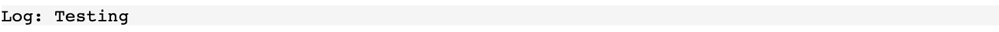

# @lmkhwana/consoletodiv

[](https://packagephobia.com/result?p=@lmkhwana/consoletodiv)

Displays console messages in an HTML element.

## Install

```
$ npm install @lmkhwana/consoletodiv
```

## Usage

- Using CDN in vanilla JS

```html

<!DOCTYPE html>
<html lang="en">
<head>
  <meta charset="UTF-8">
  <title>Title</title>
</head>
<body>
  ...
<!-- Add this code block -->
<pre id="logger" style="text-transform:capitalize;
                          background-color: #f5f5f5;
                          margin-bottom: 0;"></pre>

<script src="https://raw.githack.com/lmkhwana/consoletodiv/main/static.js"></script>
<script>
  /*
  * INITIALIZE
  */
    consoletodiv('logger')  // Logger is the id of the 'pre'
    
  /*
  * TEST
  */
    console.log('testing')
</script>
</body>
</html>

```
When you run it, the console messages should appear.



- Angular 

```html
<!-- This file is app.component.html -->
<div class="container-fluid">
  <router-outlet></router-outlet>
  ...
  <!-- Add this code block -->
  <pre id="logger" style="text-transform:capitalize;
                          background-color: #f5f5f5;
                          margin-bottom: 0;"></pre>
</div>

```

```js
// This file is app.component.ts 

import consoletodiv  from '@lmkhwana/consoletodiv';

@Component({
  selector: 'app-root',
  templateUrl: './app.component.html',
  styleUrls: ['./app.component.scss'],
})
export class AppComponent implements OnInit {

  constructor() {
   
  }

  ngOnInit() {
    consoletodiv('logger'); // Logger is the id of the 'pre' on the app.component.html
  }
}
```
When you run it, the console messages should appear at the bottom of your page.


- Vue 

```html
<!-- This file is app.vue -->
<template>
  <div id="app">
  ...
    <!-- Add this code block -->
    <pre id="logger" style="text-transform:capitalize;
                          background-color: #f5f5f5;
                          margin-bottom: 0;"></pre>
  </div>
</template>

```

```js
// This file is main.js

import Vue from 'vue'
import App from './App.vue'
...
import consoletodiv  from '@lmkhwana/consoletodiv';

Vue.config.productionTip = false

new Vue({
  render: h => h(App),
}).$mount('#app')
consoletodiv('logger') // Logger is the id of the 'pre' on the App.vue

```


